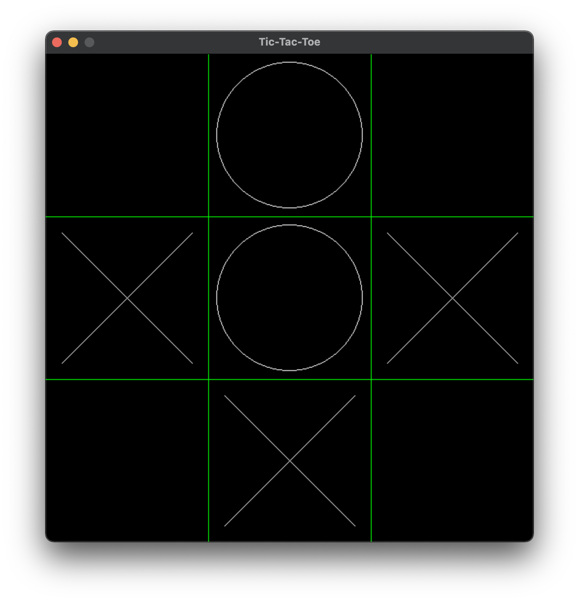

= OXO
zer0warm <dqhieu.2016@gmail.com>
v0.1, 2021-06-20

== What is it?

A simple pygame Tic Tac Toe in 3 source files. I have been wanting to finish this as I was helping a friend to code this game.

== How to play locally

----
git clone https://github.com/zer0warm/OXO.git

# (optional) make OXO a virtual environment
virtualenv OXO

cd OXO
pip install -r requirements.txt
python app.py
----

== How it works?

To simplify the process, several details are hardcoded. Clicks are handled manually based on pixel calculations.

In the game's `mainloop`, the only interesting handler is click handler. With each click, the program checks the click position and compares it to the predetermined pixel ranges to know which cell (1-9, or in the program, 0-8) to draw.

Win combinations (the 3 cells tuples that forms a row, column or diagonal) are also hardcoded, so that checking for victory is simply checking whether a tuples filled with all `'x'` or `'o'` exists. If any of them exists, announce victory and end the game. If none of them exists but all the board is filled, then it&#8217;s a draw.

== Quirks

If the click is on either four crossing points, an error is thrown.

== Demo

The demo is hosted on link:https://youtu.be/_TykLcYQqQQ[YouTube].
